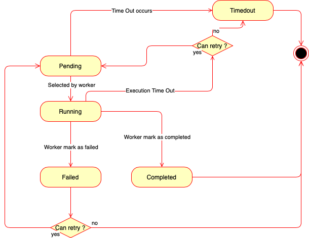

# Maestro

[](https://github.com/owlint/Maestro/actions/workflows/go.yml)

Maestro is a Task Scheduler written in Golang and supported by Owlint. 

The main features of Maestro are :

* Agnostic of the client and worker language
* Timeout
* Retries
* Cancel
* Cron Tasks
* Oblivious : No task payload or result is saved permanently. Your data is safe.

## Dependencies

* [ExentStore](https://gitlab.com/mwillema/exentstore) : An minimalist EventStore app written in Elixir
* Postgresql : As a backend for ExentStore
* MongoDB : For persistant data projections
* Redis : For non persistant data storage (Task Payload and result)

## How does tasks work ?
Once a task is created, its state automaticaly evolves following the following state diagram : 




## Run

A `.env` file must exist in current directory with this content : 
```
SECRET=CHANGEME
```

```bash
make docker.recreate
go run cmd/srv/main.go
```

Service will be bind to port 8080.

### Create task

```bash
curl --request POST \
  --url http://localhost:8080/api/task/create \
  --header 'Content-Type: application/json' \
  --data '{
	"queue": "queueName",
	"retries": 3,
	"timeout": 300,
  "payload": "some-string-payload"
}'
```

```json
{
  "task_id": "Task-74484551-70c0-41a1-a9f0-db36923379e2"
}
```

### Task State

```bash
curl --request POST \
  --url http://localhost:8080/api/task/get \
  --header 'Content-Type: application/json' \
  --data '{
	"task_id": "Task-74484551-70c0-41a1-a9f0-db36923379e2"
}'
```

```json
{
  "task_id": "Task-74484551-70c0-41a1-a9f0-db36923379e2",
  "queue": "queueName",
  "state": "pending",
  "last_update": 1614350994
}
```

If completed. When completed, the string result will be available for 5 minutes.

```json
{
  "task_id": "Task-74484551-70c0-41a1-a9f0-db36923379e2",
  "queue": "queueName",
  "state": "pending",
  "last_update": 1614350994,
  "result": "some-string-payload"
}
```
### Next Task in queue

```bash
curl --request POST \
  --url http://localhost:8080/api/queue/next \
  --header 'Content-Type: application/json' \
  --data '{
	"queue": "queueName"
}'
```

```json
{
  "task_id": "Task-74484551-70c0-41a1-a9f0-db36923379e2",
  "queue": "queueName",
  "state": "pending",
  "last_update": 1614350994,
  "payload": "some-string-payload"
}
```
### Complete task

```bash
curl --request POST \
  --url http://localhost:8080/api/task/complete \
  --header 'Content-Type: application/json' \
  --data '{
	"task_id": "Task-6b6fdc56-d9da-477f-b9ea-86f3493bae42",
  "result": "some-string-payload"
}'
```

### Fail task

```bash
curl --request POST \
  --url http://localhost:8080/api/task/fail \
  --header 'Content-Type: application/json' \
  --data '{
	"task_id": "Task-6b6fdc56-d9da-477f-b9ea-86f3493bae42"
}'
```

### Cancel task

```bash
curl --request POST \
  --url http://localhost:8080/api/task/cancel \
  --header 'Content-Type: application/json' \
  --data '{
	"task_id": "Task-6b6fdc56-d9da-477f-b9ea-86f3493bae42"
}'
```
### Timeout task

```bash
curl --request POST \
  --url http://localhost:8080/api/task/timeout \
  --header 'Content-Type: application/json' \
  --data '{
	"task_id": "Task-6b6fdc56-d9da-477f-b9ea-86f3493bae42"
}'
```
